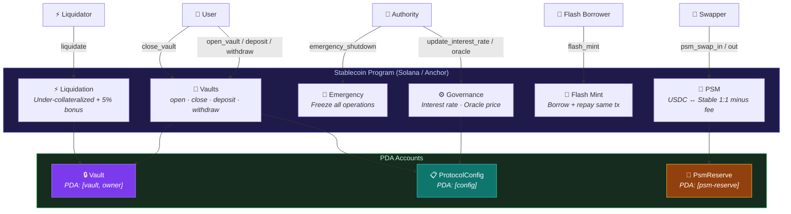

# Stablecoin Protocol

A collateral-backed stablecoin protocol on Solana, built with Anchor. Deposit SOL, mint stablecoins, manage vaults, and maintain peg stability through liquidations, PSM swaps, and flash minting.

## Architecture



## Vault Lifecycle Workflow

```mermaid
sequenceDiagram
    participant User
    participant Program as Stablecoin Program
    participant Config as ProtocolConfig (PDA)
    participant Vault as Vault (PDA)
    participant Mint as Stablecoin Mint

    rect rgb(30, 27, 75)
    Note over User,Vault: 1 — Open Vault
    User->>Program: open_vault(collateral, mint_amount)
    Program->>Config: Check collateral ratio ≥ 150%
    Program->>Vault: Create PDA [vault, owner]
    User-->>Vault: Transfer SOL collateral
    Program->>Mint: Mint stablecoins to user
    end

    rect rgb(30, 58, 38)
    Note over User,Vault: 2 — Manage Position
    User->>Program: deposit_collateral(amount)
    User-->>Vault: Additional SOL deposited
    User->>Program: withdraw_collateral(amount)
    Program->>Config: Verify ratio still ≥ 150%
    Vault-->>User: SOL returned
    end

    rect rgb(60, 20, 20)
    Note over User,Mint: 3a — Close Vault (happy path)
    User->>Program: close_vault()
    User->>Mint: Burn all debt stablecoins
    Vault-->>User: Reclaim all SOL collateral
    Program->>Vault: Close account
    end

    rect rgb(55, 48, 20)
    Note over User,Mint: 3b — Liquidation (ratio < 120%)
    participant Liquidator
    Liquidator->>Program: liquidate(vault)
    Program->>Config: Confirm ratio < 120%
    Liquidator->>Mint: Burn debt stablecoins
    Vault-->>Liquidator: Collateral + 5% bonus
    end
```



## Features

| Feature | Instruction | Description |
|---------|------------|-------------|
| Initialize | `initialize` | Set up protocol config, stablecoin mint, and collateral vault |
| Open Vault | `open_vault` | Deposit SOL + mint stablecoins in one transaction |
| Close Vault | `close_vault` | Repay all debt, reclaim collateral, close account |
| Deposit | `deposit_collateral` | Add SOL to existing vault |
| Withdraw | `withdraw_collateral` | Remove excess SOL (maintains ratio) |
| Liquidate | `liquidate` | Liquidate under-collateralized vault (5% bonus) |
| Flash Mint | `flash_mint` | Borrow + repay stablecoins within same tx |
| PSM Swap In | `psm_swap_in` | USDC → stablecoins (1:1 minus fee) |
| PSM Swap Out | `psm_swap_out` | Stablecoins → USDC (1:1 minus fee) |
| Governance | `update_interest_rate` | Update annual stability fee |
| Oracle | `update_oracle_price` | Update SOL/USD price feed |
| Emergency | `emergency_shutdown` | Freeze all protocol operations |

## Protocol Parameters

| Parameter | Default | Description |
|-----------|---------|-------------|
| Collateral Ratio | 150% | Minimum collateral-to-debt ratio |
| Liquidation Ratio | 120% | Below this → vault is liquidatable |
| Liquidation Bonus | 5% | Extra collateral awarded to liquidator |
| Stability Fee | 2%/year | Annual interest on vault debt |
| PSM Fee | 0.1% | Fee on USDC ↔ stablecoin swaps |
| Flash Mint Fee | 0.09% | Fee on flash-minted amount |

## Quick Start

### Prerequisites

- [Solana CLI](https://docs.solana.com/cli/install-solana-cli-tools) v1.18+
- [Anchor CLI](https://www.anchor-lang.com/docs/installation) v0.29+
- [Rust](https://rustup.rs/) with `rustc 1.75+`
- Node.js v18+ / Yarn

### Build

```bash
anchor build
```

### Test

```bash
anchor test
```

### Deploy (Localnet)

```bash
solana-test-validator &
anchor deploy
```

### Deploy (Devnet)

```bash
solana config set --url devnet
anchor deploy --provider.cluster devnet
```

## Project Structure

```
programs/stablecoin/
├── src/
│   ├── lib.rs                    # Program entry point
│   ├── state.rs                  # Account structs (ProtocolConfig, Vault, PsmReserve)
│   ├── errors.rs                 # Custom error codes (13 errors)
│   ├── events.rs                 # Event structs (8 events)
│   └── instructions/
│       ├── mod.rs                # Module exports
│       ├── initialize.rs         # Protocol initialization
│       ├── open_vault.rs         # Open vault + mint
│       ├── close_vault.rs        # Close vault + burn
│       ├── deposit_collateral.rs # Add collateral
│       ├── withdraw_collateral.rs# Remove collateral
│       ├── liquidate.rs          # Vault liquidation
│       ├── flash_mint.rs         # Flash minting
│       ├── psm.rs                # Peg Stability Module
│       ├── governance.rs         # Rate + oracle updates
│       └── emergency.rs          # Emergency shutdown

tests/
└── stablecoin.ts                 # Full integration test suite

migrations/
└── deploy.ts                     # Deployment script
```

## State Accounts

### ProtocolConfig (PDA: `["config"]`)
Global protocol configuration: authority, mint, ratios, fees, oracle price, shutdown flag, totals.

### Vault (PDA: `["vault", owner]`)
Per-user vault: collateral amount, debt amount, interest accrual timestamp.

### PsmReserve (PDA: `["psm-reserve"]`)
PSM state: USDC reserve account, totals for USDC reserves and stablecoins issued.

## Dependencies

- [Anchor](https://www.anchor-lang.com/) v0.29 — Solana development framework
- [SPL Token](https://spl.solana.com/token) — Token minting, burning, transfers

## License

MIT
